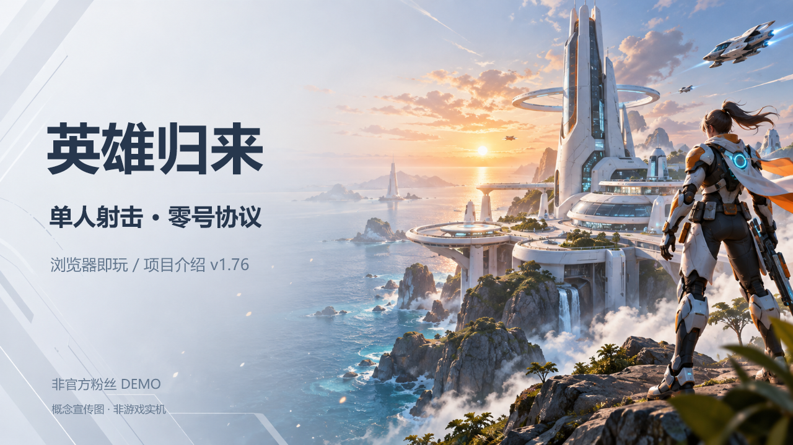
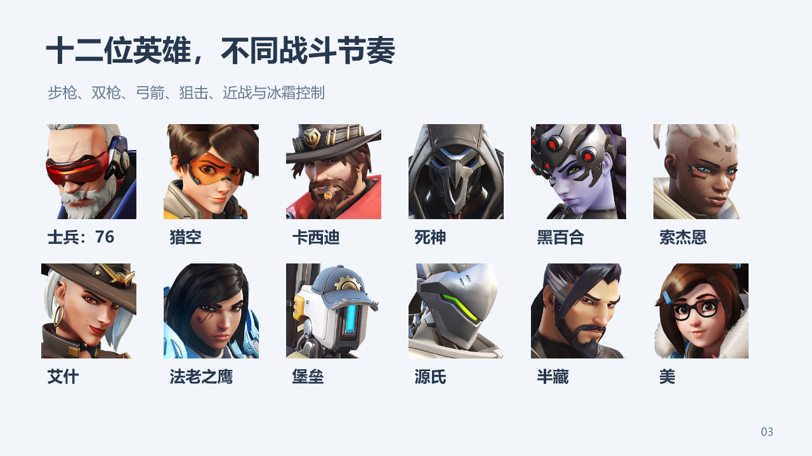
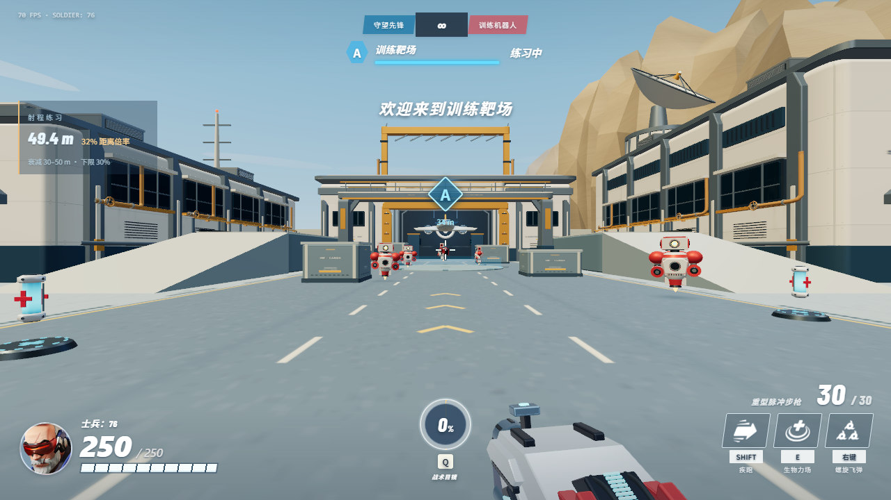
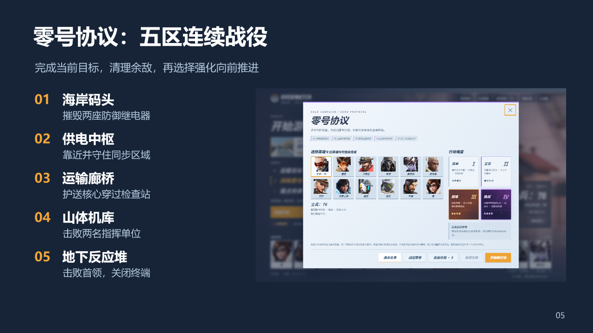
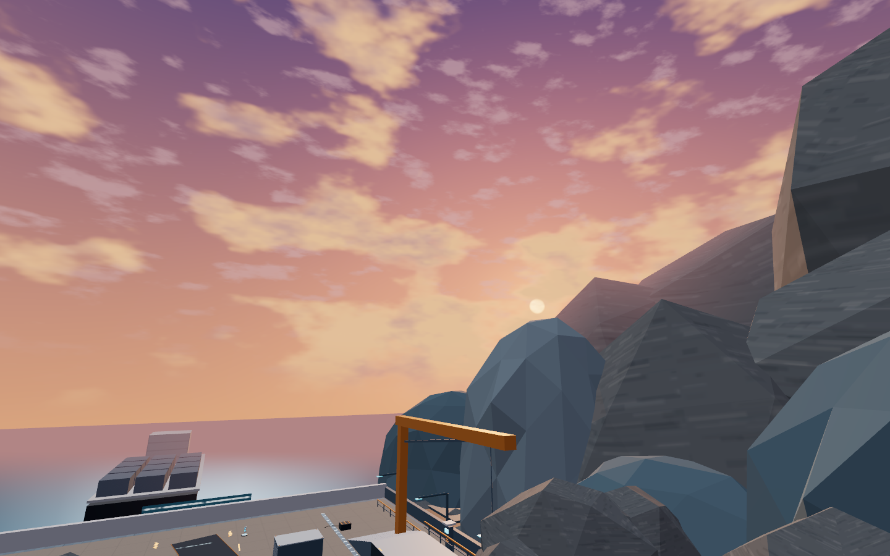
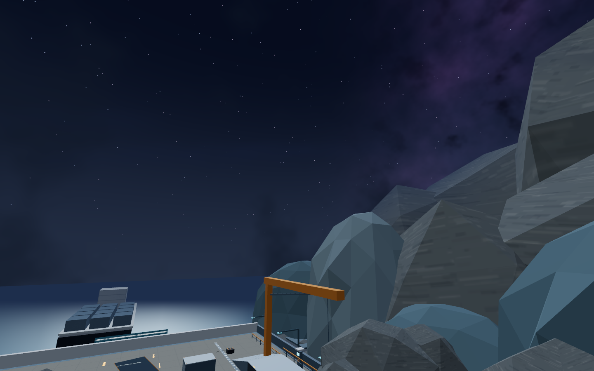
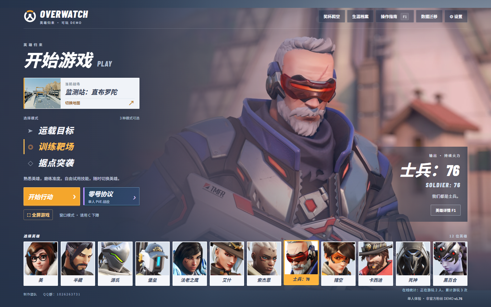

  

<h1 align="center">英雄归来 · 零号协议</h1>

<strong>选择英雄，穿过五区战场，终止零号协议。</strong>

守望先锋风格 · 非官方粉丝 DEMO · 单机网页射击 · v1.86

  <a href="https://rpq123.github.io/hero-demo/"><strong>▶ 立即开始游戏</strong></a>
  &nbsp; · &nbsp;
  <a href="https://raw.githubusercontent.com/RPQ123/hero-demo/main/docs/showcase/hero-recall-introduction-v1.76-r2.pptx"><strong>↓ 下载 10 页介绍 PPT</strong></a>
  &nbsp; · &nbsp;
  <a href="#快速上手">操作指南</a>

---

这是一个在浏览器中运行的单人第一人称射击演示项目。你可以先在训练场熟悉英雄武器与技能，再尝试经典任务，或进入连续推进的 **「零号协议」PvE 战役**。每位玩家都在自己的电脑上独立进行战斗，无需安装游戏客户端。

| 12 位可选英雄 | 8 张训练/经典场景 | 5 区连续战役 | 4 档战役难度 |
| :---: | :---: | :---: | :---: |
| 不同武器与技能节奏 | 训练、运载与据点 | 目标推进与首领战 | 从熟悉路线到挑战生存 |

> 推荐使用桌面版 Chrome / Edge，配合鼠标与键盘。首次打开需要加载游戏资源；支持手机横屏触控，首次游玩会显示旋转引导。

## v1.86 更新

零号协议新增高空进场过场：具有细长机鼻、后掠翼与嵌入式推进器的运输机飞抵峡谷舰船，镜头回到舱内后，玩家从侧门自行跳下。抵达前使用空气墙限行，落地前自由落体并禁用技能，落地后恢复操作。机舱加入一体化装甲、座椅、设备面板与照明；支持手机触控与暂停。

保留 v1.85 的四档难度减压：敌方伤害、生命与护甲、增援频率和同屏数量、摧毁目标耐久和占领耗时降低约 30%；相同运载路线在无阻挡时耗时缩短 30%。旧存档继续可用。

## 选择你的英雄

士兵：76、猎空、卡西迪、死神、黑百合、索杰恩、艾什、法老之鹰、堡垒、源氏、半藏与美。步枪、双枪、弓箭、狙击、近战与冰霜控制带来不同的操作体验；先选喜欢的英雄，进训练场试试手感。

## 从经典场景开始

| 场景 | 可体验内容 |
| --- | --- |
| 监测站：直布罗陀 | 训练靶场、运载目标、据点突袭 |
| 伊利奥斯 · 灯塔庭院 | 训练与据点模式 |
| 城堡 | 自由练习 |
| 生态监测站：南极洲 | 自由练习 |
| 花村 · 庭院道场 | 庭院、架空侧廊与高台道场 |
| 黑森林 · 林间遗村 | 村舍、缓坡与遗迹巷道 |
| 佩特拉 · 峡谷遗迹 | 岩台、断桥与双口石窟 |
| 墓园 · 月夜遗迹 | 桥廊、侧台与下沉墓室 |

不同地图有各自的路线与可用模式。选择英雄、地图和模式后，点击 **「开始行动」** 进入地图。

## 零号协议：一场五区连续行动

1. **舰艉登陆区** — 从运输机下到甲板，摧毁交错闭合的防御继电器。
2. **供电中枢** — 依次同步正面及两侧高台节点，在增援压力下守住目标。
3. **运输甲板** — 沿转弯路线护送核心，摧毁干扰器后继续推进。
4. **舰载机库** — 击败指挥单位并摧毁装配控制核。
5. **核心反应堆** — 击败三阶段「协议守卫」，清理余敌，靠近终端并按住 **T** 三秒完成行动。

任务未完成时会持续增援。完成目标并清理剩余敌人后，前四区各有一次 **三选一强化**；确认强化，再沿任务标记步行通过设施通道进入下一区域。掩体、高低差、技能释放和目标优先级共同影响推进节奏。

## 四档难度，变化的战场氛围

| 难度 | 体验重点 | 场景氛围 |
| --- | --- | --- |
| 简单 | 熟悉路线、技能与任务规则 | 晴空 |
| 正常 | 标准战役体验 | 晴空 |
| 困难 | 更高敌人压力、更少补给 | 黄昏 |
| 挑战 | 无血包，仅允许脱战恢复 | 风暴与夜空 |

  
  

## 进度、存档与荣誉

- **自动续玩 + 5 个自由存档位**：保留英雄、难度和已确认强化，按检查点继续行动。读档会重建当前区域，并非恢复战斗瞬间的全部状态。
- **本地数据导入导出**：将 JSON 备份带到另一台电脑，在兼容版本中确认导入。设置、荣誉与存档保存在当前浏览器，**不会自动云同步**；迁移或清理浏览器数据前，先导出备份。
- **30 项战役荣誉**：记录自己的战役进展。
- **可选社区通关名录**：通关后可自愿提交昵称与记录。这是客户端上报的社区记录，不是经过反作弊认证的竞技排名。

### 当前在线统计如何计算？

v1.76 中，打开页面即计入在线，停留主菜单、暂停或切到后台仍保留在线；同一浏览器的多个标签页会去重。进入或读档进入地图时增加累计游玩次数，单纯刷新首页不增加次数。异常断开后，人数可能在租约到期后才更新。

统计与社区名录依赖网络服务。战斗依然是本地单机运行，名录和在线人数不表示多人联机对战。截图中的人数与次数仅代表截图时刻。

## 快速上手

1. 打开 **[在线游戏](https://rpq123.github.io/hero-demo/)**，等待首次加载完成。
2. 选择英雄；新玩家可先进入训练靶场，或选择简单难度的零号协议。
3. 点击游戏画面进入鼠标控制；使用游戏内全屏入口可获得更完整的视野。
4. 按 **Esc** 暂停并释放鼠标，在游戏设置中查看或调整键位。

| 操作 | 默认按键 |
| --- | --- |
| 移动 | W / A / S / D |
| 瞄准、射击 | 鼠标移动、左键 |
| 换弹 | R |
| 终极技能 | Q |
| 暂停 / 释放鼠标 | Esc |

英雄专属技能以游戏内 HUD 与键位设置为准。若更新后仍显示旧版本，可尝试 **Ctrl + F5** 强制刷新。

## 版本与介绍资料

当前公开版本：**v1.86**。下方介绍 PPT 与部分宣传截图保留自早期版本；当前玩法与画面以在线游戏为准。

- [下载中文介绍 PPTX（10 页）](https://raw.githubusercontent.com/RPQ123/hero-demo/main/docs/showcase/hero-recall-introduction-v1.76-r2.pptx)
- [查看完整操作入口图](docs/showcase/play-guide.png)
- [第三方素材与开源组件说明](THIRD_PARTY_NOTICES.txt)

封面及结束页采用 AI 生成的概念宣传插图，**不代表游戏实机画质**。其他配图来自项目实机或界面截图；经典训练图沿用 v1.73 的验证素材，PPT 数据迁移图沿用 v1.74 的界面示例，战役氛围图来自当前构建。

## 关于这个项目

这是非官方粉丝制作的演示项目，与 Blizzard Entertainment 无隶属或官方合作关系。Overwatch / 守望先锋相关角色、名称、头像与图标的权利归各自权利人所有；第三方素材及 Three.js 许可见 [THIRD_PARTY_NOTICES.txt](THIRD_PARTY_NOTICES.txt)。

本仓库用于发布可直接游玩的网页构建与介绍资料。完整开发工程保留在本地；网页运行所需的前端代码会随页面交付给浏览器。
